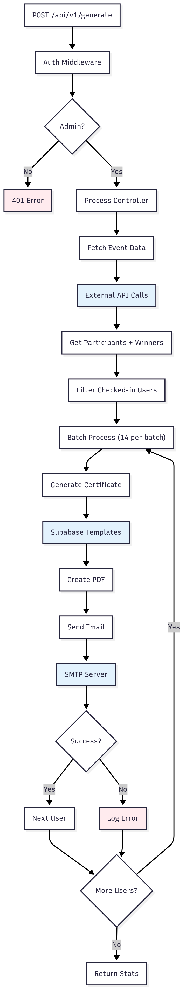

# Charter

A robust Node.js microservice for automatically generating and emailing event certificates to participants. Built with Express.js, this service integrates with external APIs to fetch participant data and uses Supabase for certificate template management.

## 🎯 Overview

The Charter is designed to streamline the certificate distribution process for events. It automatically:

- Fetches participant data from external APIs
- Generates personalized PDF certificates using SVG templates
- Sends certificates via email with professional formatting
- Handles both participation and winner certificates
- Processes participants in batches for optimal performance

## 🏗️ System Architecture




## 🛠️ Technology Stack

- **Runtime**: Node.js 20 (Alpine)
- **Framework**: Express.js
- **PDF Generation**: PDFKit + SVG-to-PDFKit
- **Email**: Nodemailer
- **Authentication**: JWT
- **Storage**: Supabase (templates, fonts)
- **HTTP Client**: Axios
- **Containerization**: Docker & Docker Compose

## 📋 Prerequisites

- Node.js 20+
- Docker (optional)
- SMTP server credentials
- Supabase account and project
- External Events API access

## 🔧 Environment Variables

Refer to `.env.example` for the complete list of required environment variables. Copy it to `.env` and update values as needed.

```bash
cp .env.example .env
# then edit .env
```

## 🚀 Installation & Setup

### Local Development

1. **Clone the repository**
   ```bash
   git clone https://github.com/ABHAY-100/Charter.git
   cd Charter
   ```

2. **Install dependencies**
   ```bash
   npm install
   ```

3. **Configure environment variables**

4. **Start the development server**
   ```bash
   npm run dev
   ```

### Docker Deployment

1. **Build and run with Docker Compose**
   ```bash
   docker-compose up --build
   ```

2. **Or build manually**
   ```bash
   docker build -t Charter .
   docker run -p 5000:5000 --env-file .env Charter
   ```

## 📡 API Endpoints

### Generate Certificates
```http
POST /api/v1/generate
Authorization: Bearer <jwt_token>
Content-Type: application/json

{
  "eventId": event_id, // integer value required
  "cName": "certificate_name" // (optional)
}
```

## 🎨 Certificate Templates

### Supabase Table Schema

Certificate templates are managed in Supabase with the following schema:

```sql
create table public.certificate_templates (
  id uuid not null primary key,
  c_name text not null,
  c_type integer not null,
  svg_path text not null,
  constraints jsonb null,
  main_font_path text null,
  name_font_path text null
);
```

#### Field Explanations

- **c_name**: Certificate name (e.g., "EXCEL MAIN DAYS")
- **c_type**: Certificate type (`0` for Participation, `1` for Appreciation)
- **svg_path**: File name of the SVG template stored inside the Supabase Storage bucket `certificate-templates`
- **main_font_path**: File name of the main font stored inside the Supabase Storage bucket `certificate-fonts`
- **name_font_path**: File name of the font used for participant names stored inside the Supabase Storage bucket `certificate-fonts`
- **constraints**: JSON object for template constraints, e.g.  
  `{"max_width": 598}`  
  This defines the maximum width (in px) for the participant name text field on the certificate.

### Template Variables
- `{p_name}`: Participant name
- `{e_name}`: Event name
- `{c_type}`: Certificate type (Participation/Appreciation)
- `{pos}`: Position text (First Prize/Second Prize/Third Prize)

### Template Design Guidelines
- Prefer SVG assets for all decorative elements for crisp output
- Avoid raster images (PNG/JPG) in design wherever possible
- Template must be in SVG format - design in Figma (Preferred) and export as SVG
- Flatten all decorative elements except text fields with template variables
- Ensure participant name text is centered relative to the certificate

---

**Built with ❤️ by Excel Core '25**
